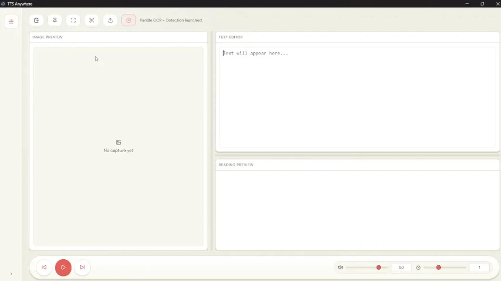
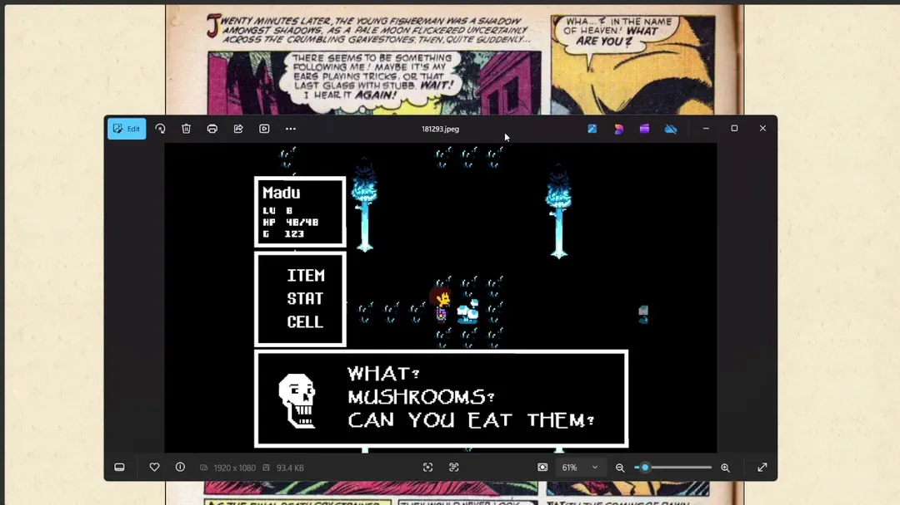
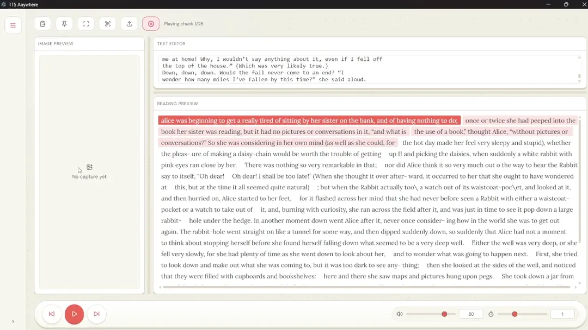
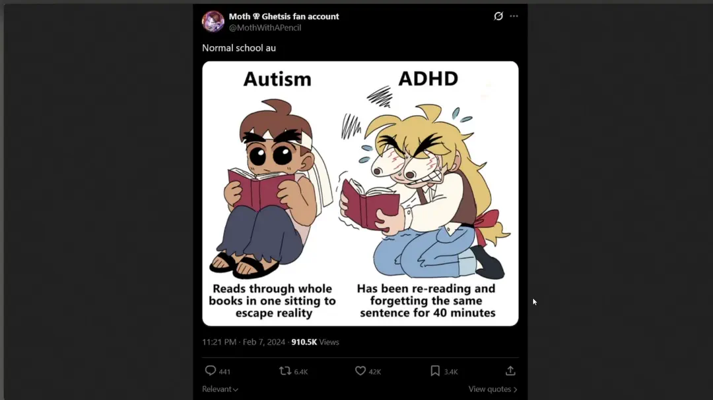

# TTS Anywhere

TTS Anywhere is a Windows-first desktop app for grabbing text from anywhere on your screen and hearing it immediately. It supports direct text selection, screenshot OCR, live playback while you edit, and optional local detector-assisted preprocessing when screenshots need more control.

The app treats cloud and local providers as equal options. It has native support for the Google Gemini SDK, OpenAI-compatible APIs, and local OCR/TTS adapters. In practice, many people will likely use cloud providers, but the app is built so either path can be the main one.

It is not meant to be a full screen reader. It is aimed more at people who want fast, selective read-aloud help: people with low vision, dyslexia, ADHD or other attention issues, people reading in a language they are not fully comfortable with, and people who simply prefer listening over reading in some situations.



## What It Does

- Read highlighted text from almost anywhere with a user-assigned hotkey.
- Capture a region, full screen, or active window and send it through OCR straight into playback.
- Keep editing the recognized text while chunked audio playback keeps up live.
- Paste, drop, or load images when you already have the screenshot.
- Optionally use RapidOCR or PaddleOCR to detect text boxes before OCR.
- Refine image cleanup and box selection before OCR when screenshots are noisy.

## Feature Tour

### Read Selected Text Anywhere

Select text anywhere on your PC, trigger your configured hotkey, and the app copies that selection into the editor and starts reading it aloud. This flow skips screenshot OCR entirely and is the fastest way to turn highlighted text into speech.


### OCR a Region, Full Screen, or Active Window

If the text is not selectable, the app can capture a region, the full screen, or the active window, run OCR on the image, and start playback immediately. It also remembers the last selection rectangle so you can replay the same capture area again.




### Keep Editing While Audio Keeps Up

Playback is chunked so the editor stays usable while audio is running. You can fix OCR mistakes, rewrite text, or keep typing while playback state updates around the active chunks instead of forcing a hard stop on every small edit.



## Optional Workflows

### Detect Only the Text Regions First

If you run a local RapidOCR or PaddleOCR detector, the app can identify likely text regions first and then send only those regions into OCR. That is useful for cluttered screenshots, mixed UI layouts, and anything where full-image OCR would pick up too much noise.


### Refine the Image or Boxes Before OCR

The preprocessing lab lets you tune threshold, contrast, brightness, dilation, inversion, selection masks, manual boxes, and merge/sort behavior before OCR runs. This is the path to use when the screenshot needs cleanup or when you want tighter control over which text gets sent to the model.



## Common Workflows

### Capture text from the screen

Use the capture hotkeys or the app controls to:

- select a region
- capture the full screen
- capture the active window
- replay the last capture

The normal flow is OCR into immediate playback. The captured text is also available in the editor if you want to fix it, replace it, paste something else in, or run it again.

### OCR an existing image

You can paste an image from the clipboard or load one into the app, then run OCR on it the same way you would with a screen capture.

### Use the preprocessing lab

The preprocessing lab is for images that are hard to read cleanly on the first pass. Use it when text is small, blurry, low-contrast, or mixed with UI chrome. Box-based text region detection in the lab depends on a local RapidOCR or PaddleOCR service. If you want detection boxes and region-aware preprocessing, you need one of those local services running.

### Listen with TTS

OCR normally starts the readout immediately. The editor is still there for manual use: paste text, write your own text, fix OCR mistakes, or rerun playback with edited text. Playback controls let you pause, resume, skip through chunks, replay the latest capture, or adjust volume.

## Best Way to Run It

The main experience is the Electron app.

Install dependencies:

```bash
npm install
```

Run the desktop app in development:

```bash
npm run dev:electron
```

Build the desktop app:

```bash
npm run build:electron
```

Build the Windows distributable:

```bash
npm run dist:win
```

If you only want the browser renderer during development:

```bash
npm run dev:web
```

## Provider Support

### Cloud / API Support

| Provider path | What it supports |
| --- | --- |
| Gemini SDK | Google Gemini models through the native `@google/genai` SDK, including Gemini OCR/text flows and Gemini TTS |
| OpenAI-compatible API | Any service that exposes OpenAI-style OCR/chat and/or TTS endpoints. This includes hosted providers and local adapters |

### Local OCR Support

| Local stack | Type | Notes |
| --- | --- | --- |
| PaddleOCR service | Local OCR + text detection | Recommended managed local OCR stack; supports CPU and GPU launch paths |
| RapidOCR service | Local OCR + text detection | Lightweight local OCR alternative |
| H2OVL Mississippi | Local OCR | OpenAI-compatible GPU OCR service for `h2oai/h2ovl-mississippi-800m` |

### Local TTS Support

| Local stack | Type | Notes |
| --- | --- | --- |
| Edge TTS adapter | Local adapter / online voice service | Lightweight OpenAI-compatible TTS path exposed locally |
| KittenTTS adapter | Local TTS | CPU-oriented OpenAI-compatible adapter for KittenTTS |
| Kokoro adapter | Local TTS | OpenAI-compatible GPU TTS |
| Piper adapter | Local TTS | Lightweight OpenAI-compatible Piper backend |

## Notes on Local Services

- You do not need local OCR or TTS services for the basic cloud-provider flow.
- Cloud and local providers are both first-class options in the app.
- Local services are useful when you want self-hosting, lower cloud usage, or tighter control over preprocessing and model selection.
- Detection boxes and the full local preprocessing flow require a local RapidOCR or PaddleOCR service.
- The UI can launch the recommended managed local services directly for Paddle OCR + Detection and Edge TTS.

### Windows Service Scripts

When you use the packaged Windows app, the bundled service scripts are placed under:

`AppData\Roaming\TTS Anywhere\runtime\services\...`

For text-processing services, the same scripts also exist in the repo during development under:

`services/text_processing/<provider>/scripts/`

For example, Paddle detect-only hosting is available at:

- Installed app: `AppData\Roaming\TTS Anywhere\runtime\services\text_processing\paddle\scripts\host_detect.bat`
- Dev/repo: `services/text_processing/paddle/scripts/host_detect.bat`

Use the text-processing batch files like this:

- `host_detect.bat`: start only text box detection. Use this when you only want region detection for the preprocessing lab.
- `host_ocr.bat`: start only OCR extraction.
- `host_both.bat`: start both detection and OCR in one service.
- `host_detect_gpu.bat`, `host_ocr_gpu.bat`, `host_both_gpu.bat`: GPU-oriented launch variants where supported.
- `host_both_cpu_ocr_gpu.bat` and `host_both_gpu_ocr_cpu.bat`: mixed CPU/GPU launch variants where available.

These script sets exist for both Paddle and Rapid text-processing services:

- `services/text_processing/paddle/scripts/`
- `services/text_processing/rapid/scripts/`

If your goal is only preprocessing-lab box detection, start `host_detect.bat` for either Paddle or Rapid and point the app's Text Processing Server URL at that service.

## Development

Useful commands:

```bash
npm run typecheck
npm run test
npm run build:web
npm run build:electron
```

The Python adapters and OCR services live under `services/` and have their own READMEs if you want to run or modify them directly.
